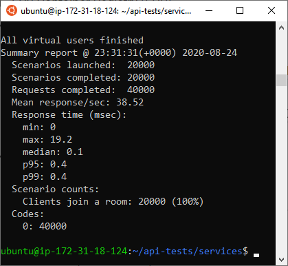

# Load Testing the River Infrastructure

To load test the deployed River infrastructure on AWS, the following setup was used:

- two c5.large EC2 instances
- the artillery.io testing framework
- the "demo" server

## Overview

To simulate a significant load on our River infrastructure, we used these conditions:

- add 100 new users (connections) per second, for a total of 20,000 users
- upon connection, each new user:
  - subscribes to a channel
  - holds the connection for 10 minutes
  - subscribes to one more channel
  - disconnects

The "demo" server treats the channel as a "presence" channel, meaning that each time a new subscription happens, a websocket message announcing the new user is sent to all the other users subscribed to that channel.

As the number of connections grew, the rate of connections slowed to more like 15 per second, so in the last second (connecting users 19986 thru 20000) of connections being made:

- connection 19986 results in 19985 messages being sent
- connection 19987 results in 19986 messages being sent
- ... etc.
- connection 20000 results in 19999 messages being sent.

Which means towards the final stages of making all the connections, the server was sending about 300,000 messages per second.

River was able to handle this load without any errors.



## River setup

The server we used for testing River is identical to the final server, except to simulate a heavy load, it emits "presence" channel information. The code can be found [here](https://github.com/river-live/server/blob/demo/server.js) in our server repo under the `demo` branch.

### ECS Service settings

River was deployed with the following service definition:

```
cpu: 1024,
desiredCount: 2,
memoryLimitMiB: 2048
```

This gives two containers each one virtual cpu, and 2Gb of memory. Auto-scaling was not used during the test.

### Tuning the Task Definition

At first the test was resulting in a lot (3,000 out of 10,000) of XHR Polling errors once above a certain number of connections (7,000ish). This meant that the connections were dropping and the socket.io clients were falling back to polling, but the polling was failing.

To remedy this, the `"nofile" ulimits` of the container were increased, allowing more open files, since each new connection results in a new file being opened. ECS gives a soft limit default of `1024` and a hard limit default of `4096`, so it makes sense that we were seing connection errors as we closed in on 7,000 connections with two tasks (containers) running.

`ulimits` were increased to this:

```
"ulimits": [
                {
                    "name": "nofile",
                    "softLimit": 50000,
                    "hardLimit": 65536
                }
            ],
```

The hard limit of `65536` represents the number of possible ports on a container.

Once this was updated, the test ran without any errors.

## Artillery.io setup

The `.yml` file used to run the test is in the `services` directory of this repo. Artillery.io was chosen because of its native support for socket.io, which is the underlying engine for River.

Beyond the configuration of the `.yml` file, no additional setup was required.

To run the test:

```
artillery run load-balancer.yml
```

## EC2 setup

- Ubuntu 18.04
- c5.large

Once a terminal is open with a `ssh` connection, install the LTS version of Node.js

```
curl -sL https://deb.nodesource.com/setup_lts.x | sudo -E bash -
sudo apt-get install -y nodejs
```

install artillery.io

```
npm install -g artillery
```

This will throw a permissions error which can be fixed by changing the directory ownership

```
whoami
sudo chown -R $USER /usr/lib/node_modules
```

Change the limit for number of files open at a time (each WebSocket connection creates a new file):

```
ulimit -n 65536
```
